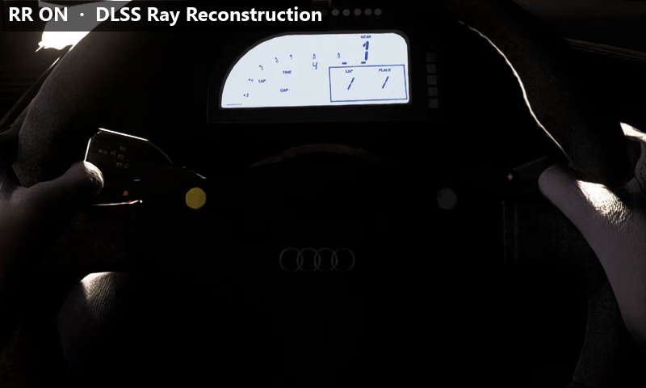
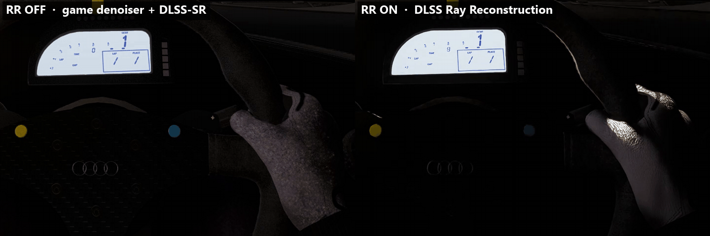
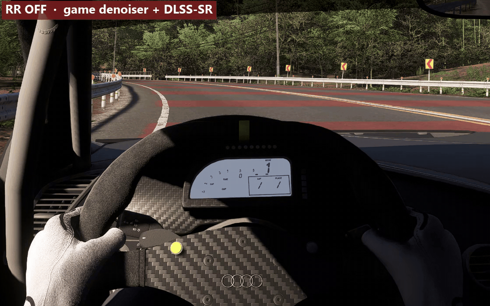

# Ray Reconstruction para Forza Horizon 6

**DLSS Ray Reconstruction (DLSS-RR) no Forza Horizon 6 para PC, como add-on do ReShade.** 
Um denoiser melhor para a iluminação com ray tracing do jogo, para qualquer placa NVIDIA RTX.

[English](../README.md) ·
[Español](README.es.md) ·
**Português (BR)** ·
[Français](README.fr.md) ·
[Deutsch](README.de.md) ·
[Italiano](README.it.md) ·
[Polski](README.pl.md) ·
[Русский](README.ru.md) ·
[Türkçe](README.tr.md) ·
[日本語](README.ja.md) ·
[한국어](README.ko.md) ·
[简体中文](README.zh-CN.md)

> [!NOTE]
> Esta tradução pode estar atrasada em relação ao [README em inglês](../README.md), que é a referência.
> A documentação técnica para modders está só em inglês, em [docs/](../docs/). O menu dentro do jogo
> está em inglês (ou espanhol); os nomes das opções abaixo aparecem em inglês, como no menu.

> [!IMPORTANT]
> Beta. Eu o fiz sozinho e só testei no meu PC. Funciona, mas ainda há problemas abertos
> nos quais estou travado. Se você entende de programação gráfica, DLSS/Streamline ou modding de
> shaders, sua ajuda é muito bem-vinda: veja a seção "Onde é preciso ajuda".

## O que ele faz

O Forza Horizon 6 oferece DLSS Super Resolution, DLAA, Frame Generation e Multi Frame Generation, mas
não Ray Reconstruction, embora a pasta do jogo já tenha o plugin RR do Streamline (`sl.dlss_d.dll`) e o
modelo do RR (`nvngx_dlssd.dll`). Este add-on o ativa:

1. Adiciona o DLSS-RR às funções que o jogo pede para o Streamline carregar.
2. Sempre que o jogo avalia o DLSS Super Resolution, ele avalia o DLSS Ray Reconstruction no lugar,
   com as mesmas entradas. Qualquer frame em que falte algo volta para o DLSS normal do jogo.
3. A cada frame, monta os buffers-guia de que o RR precisa a partir do G-buffer de ray tracing do jogo:
   normais do mundo + rugosidade, albedo difuso, albedo especular e distância de impacto difusa.
4. Pode alterar os filtros de denoise do GI com ray tracing do próprio jogo: por padrão eles acumulam
   quatro vezes mais histórico ("History x4", a imagem mais estável), e no modo "Full RR" são removidos
   para que o RR limpe diretamente a iluminação global bruta.

O executável e os arquivos do jogo nunca são modificados. Tudo acontece na memória, dentro do ReShade.

**O que você ganha:** iluminação com ray tracing mais limpa, com menos "fervura" e cintilação na luz
indireta (paredes à noite, túneis, sombras). Geometria fina, como cercas e cabos, costuma ficar mais
nítida.

**O que custa:** um pouco de tempo de GPU e de VRAM (veja "Desempenho").

## Comparação

Gravei estes clipes no jogo, no meu PC (RTX 4050 Laptop GPU, 1920×1200, carro parado). Eles mostram
pixels reais em 1:1, recortados da gravação. O modo de GI era **"Full RR"** (experimental), não o
padrão "History x4".

**Túnel, visão do cockpit.** Aperto F11 e o RR desliga: as luvas e o volante começam a ferver.

**O mesmo túnel, lado a lado** (esquerda: desligado, direita: ligado).

**Cockpit numa estrada de floresta.** Dois momentos da mesma cena, com 4 s de diferença, em loop:
desligado e depois ligado. Com RR, as luvas, a coluna A e o painel param de ferver, e os anéis da Audi
no volante recuperam o reflexo metálico.

No clipe da floresta, o ruído temporal da luva direita cai de 2,3 para 0,3–0,5 (medido na gravação).
Com RR o cockpit também fica um pouco mais escuro, e ainda não sei qual dos dois está mais perto do
brilho correto. Fora do carro, de dia, a diferença é bem menor. Detalhes em
[docs/MEASUREMENTS.md](../docs/MEASUREMENTS.md#from-a-gameplay-recording-7-oct-2026) (em inglês).

## Requisitos

- Uma placa **NVIDIA GeForce RTX**. O Ray Reconstruction roda em todas as gerações RTX (séries 20, 30,
  40 e 50), mas até agora só testei na minha RTX 4050 Laptop (6 GB).
- **Forza Horizon 6** para PC, versão **6.440.853.0** (a versão em que foi desenvolvido). Em outras
  versões o RR deve continuar funcionando; os modos de GI precisam que os shaders do jogo não mudem, e
  o menu avisa quando mudaram.
- Nas opções de vídeo do jogo: **DLSS** como upscaler (qualquer modo de qualidade) e **iluminação
  global com ray tracing** ativada. Frame Generation e Multi Frame Generation podem continuar ligados.
- **ReShade 6.8.0 ou mais recente com suporte completo a add-ons** (em [reshade.me](https://reshade.me),
  o download "with full add-on support").
- Os arquivos de RR do Streamline do próprio jogo (`sl.dlss_d.dll`, `nvngx_dlssd.dll`), que já vêm com
  o jogo. Testado com Streamline 2.14.1 e DLSS-RR 310.9.0 / 310.9.1.

## Instalação

1. Instale o **ReShade com suporte completo a add-ons** para o `ForzaHorizon6.exe` e escolha
   **DirectX 10/11/12**. Não é preciso nenhum shader de efeito.
2. Baixe `rr-forza-<versão>.zip` em [Releases](https://github.com/Felix-37/fh6-ray-reconstruction/releases)
   e copie `rr-forza.addon64` para a pasta do jogo, ao lado do `ForzaHorizon6.exe`.
3. Abra o jogo. Nas opções de vídeo, escolha DLSS e ative a iluminação global com ray tracing.
4. Dirija por alguns segundos e abra o overlay do ReShade (tecla `Home` por padrão). Na aba
   **Ray Reconstruction**, o status deve dizer **"Ray Reconstruction active"**.

**Para desinstalar,** apague `rr-forza.addon64`. As configurações ficam no `ReShade.ini`, seção
`[RR_Forza]`, que você também pode apagar.

## Uso

- **F11** alterna entre o Ray Reconstruction e o DLSS normal do jogo, para comparar.
- A aba **Ray Reconstruction** do overlay do ReShade tem todas as configurações. Cada uma mostra se de
  fato chegou à GPU (`[OK]`, `[...]` ou `[ERROR]`).
  - **General:** idioma (English / Español), RR ligado/desligado, preset do RR (recomendado: F),
    nitidez do RR.
  - **Guides:** como as superfícies são descritas ao RR (folhagem, metalness) e um diagnóstico.
  - **Game GI:** o que acontece com os filtros do GI com ray tracing do jogo (veja a tabela).
  - **Measurement:** uma bancada de medição integrada que compara o RR com o DLSS normal usando números
    reais.
  - **Developer:** captura de frame, exportação dos shaders do jogo e atalhos de desenvolvimento (F7,
    F10; desligados por padrão).
  - **Help:** teclas, arquivos e limites conhecidos.

| Modo "Game GI" | O que faz |
|---|---|
| Game original | Os filtros RTGI do jogo ficam intactos e o RR limpa o resultado deles. |
| History x2 | O filtro temporal do jogo acumula 2 vezes mais frames: menos fervura, mas a luz reage mais devagar. |
| **History x4** (padrão, recomendado) | O mesmo com 4 vezes mais frames: a imagem mais estável, com boa qualidade e sem os problemas abertos do Full RR. A luz indireta reage um pouco mais devagar (possível rastro em sombras que se movem). |
| No temporal filter | O GI bruto de cada frame vai para o RR. Experimental. |
| Full RR | Os filtros RTGI temporal e espacial do jogo são substituídos e o RR faz todo o denoise. A melhor imagem de dia (nenhuma fervura na luz indireta), mas com os problemas abertos de "Problemas conhecidos". Enquanto a câmera se move, passa sozinho para "History x4". Experimental. |

Os valores padrão são a minha recomendação, escolhidos depois das medições de
[docs/MEASUREMENTS.md](../docs/MEASUREMENTS.md) e de muitas horas dirigindo. "Restore defaults" (aba
Guides) os traz de volta.

## Desempenho

Medido na minha RTX 4050 Laptop, com saída em 1920×1200, resolução interna de 1280×800, Multi Frame
Generation 4x e limite de 138 fps:

- O RR custa cerca de 0,9 ms de GPU a mais por frame exibido do que o DLSS-SR no mesmo modo de
  qualidade (−6 % de fps quando a GPU é o limite).
- O RR em DLSS **Balanced** custou o mesmo que o DLSS-SR do jogo em **Quality** (mesmos fps, mesma
  carga de GPU), sem perda visível. É a combinação que eu recomendo.
- Os dois modelos ficam carregados para que o F11 alterne sem problemas. Isso usa algumas centenas de
  MB a mais de VRAM, o que fica apertado em placas de 6 GB: ali o jogo já avisa "out of VRAM" sem RR.

## Problemas conhecidos

Ainda em aberto; as evidências reunidas até agora estão em
[docs/OPEN-PROBLEMS.md](../docs/OPEN-PROBLEMS.md) (em inglês):

1. **Ruído em movimento (Full RR):** por alguns frames aparece ruído bruto quando você se move ou
   quando algo volta para a tela. "GI history x4 while moving" e "Disocclusion assist" reduzem, mas não
   eliminam.
2. **Reflexos tipo espelho** (vidro, cromados, pintura brilhante) continuam com ruído, sobretudo no
   Full RR. Provavelmente o RR precisa de vetores de movimento especulares; a opção experimental
   "Specular motion vectors" (aba Guides, desligada por padrão) os fornece com uma distância estimada,
   e ainda não foi medida.
3. **Pontos brilhantes à noite (Full RR):** bem menos frequentes com o "Isolated sample clamp", mas não
   somem de vez.
4. **Copas de árvores contra um céu claro** podem parecer queimadas (claras demais) com o RR.
5. **Fervura lenta em túneis** com os filtros GI do jogo (original ou History x4): o RR reduz (−17 a
   −22 %), mas não elimina; pode vir das sombras RT e não do GI.

## Perguntas frequentes

**Funciona em GPUs AMD ou Intel?** Não. O DLSS Ray Reconstruction só roda em GPUs NVIDIA RTX.

**Posso ser banido?** Não conheço nenhum caso, mas não posso prometer nada. O add-on não toca nos
arquivos do jogo: ele intercepta a biblioteca Streamline da NVIDIA e o Direct3D 12 dentro do processo
do jogo, como fazem os add-ons do ReShade. Usar online é por sua conta e risco.

**Funciona com outros mods?** Eu o uso junto com o add-on "MFG Unlock" do RenoDX sem problemas. Outras
combinações (OptiScaler, troca de DLLs do DLSS) não foram testadas.

**A aba Game GI diz que os filtros "não foram vistos" ou que uma variante "não foi criada".** Dirija
alguns segundos antes. Se continuar assim, provavelmente sua versão do jogo tem outros shaders. Abra
uma issue com a versão do jogo e o seu `ReShade.log`.

**Onde fica o log?** `ReShade.log`, na pasta do jogo. As linhas deste add-on começam com `[RR Forza]`.

## Onde é preciso ajuda

Este projeto precisa de pessoas que saibam mais do que eu sobre alguns destes temas:

- **Vetores de movimento especulares e distância de impacto especular para o RR**, para corrigir os
  reflexos com ruído. O mod Control RR, do speedlemur, fez isso. Os reflexos do Forza são consultas de
  raios inline mais uma pirâmide de mips, descritos em [docs/FRAME-MAP.md](../docs/FRAME-MAP.md).
- **Ruído de desoclusão no Full RR:** como dar ao RR um ponto de partida melhor para pixels sem
  histórico.
- **Copas de árvores queimadas:** a folhagem animada pelo vento não tem vetores de movimento próprios.
  Uma máscara de responsividade ou de "cor atual" ajudaria?
- **Testes em outras GPUs RTX**, resoluções e versões do jogo, e **capturas ou vídeos lado a lado**
  (mesmo lugar, F11 alterna o RR). Este README ainda não tem imagens de comparação.

Comece por [CONTRIBUTING.md](../CONTRIBUTING.md), depois [docs/ARCHITECTURE.md](../docs/ARCHITECTURE.md)
(como o add-on funciona) e [docs/MEASUREMENTS.md](../docs/MEASUREMENTS.md) (o que foi testado, medido e
descartado, para ninguém repetir). Para compilar, bastam ferramentas gratuitas:
[docs/BUILDING.md](../docs/BUILDING.md).

## Créditos

- **speedlemur**, pelo [Control Ray Reconstruction](https://github.com/speedlemur/renodx/tree/control-rr):
  a mesma ideia (responder à avaliação DLSS-SR do jogo com DLSS-RR) e a técnica de substituir shaders em
  tempo de execução.
- **crosire**, pelo [ReShade](https://github.com/crosire/reshade) e sua API de add-ons.
- **clshortfuse e os colaboradores do RenoDX**, pelo [RenoDX](https://github.com/clshortfuse/renodx),
  cuja convenção de hash de shaders é usada aqui.
- **NVIDIA**, pelo [Streamline](https://github.com/NVIDIA-RTX/Streamline) e pelo DLSS.
- **Tsuda Kageyu** ([MinHook](https://github.com/TsudaKageyu/minhook)), **Omar Cornut**
  ([Dear ImGui](https://github.com/ocornut/imgui)) e **Microsoft**
  ([DirectX Shader Compiler](https://github.com/microsoft/DirectXShaderCompiler)).

Licenças de terceiros: [THIRD_PARTY_NOTICES.md](../THIRD_PARTY_NOTICES.md).

## Aviso legal

Este é um projeto não oficial feito por fãs. Não é afiliado nem endossado pela Microsoft, Xbox Game
Studios, Playground Games ou NVIDIA. Forza Horizon é uma marca registrada da Microsoft. NVIDIA, RTX e
DLSS são marcas registradas da NVIDIA Corporation.

O repositório não contém arquivos do jogo. Para oferecer os modos de GI, a versão compilada contém
versões modificadas de dois compute shaders do jogo, que não servem para nada sem o jogo. Use por sua
conta e risco.

O código é distribuído sob a [licença MIT](../LICENSE).
